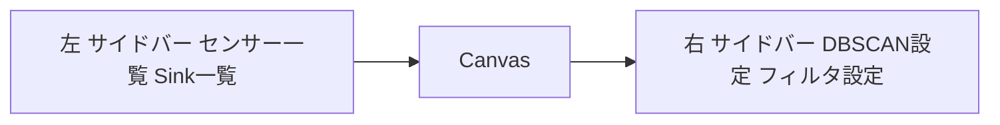

# HokuyoHub 実装計画 2025-08-18

本書は docs/implementation-plans.md に記載の4項目についての実装計画です。実装前に管理者承認を得てください。

対象TODO
- dbscanの設定をブラウザで設定可能にする
- センサーの設定をブラウザから追加可能にする
- Sinkの設定をブラウザで設定可能にする
- ブラウザのUIのレイアウトを変更

---

1. dbscanの設定をブラウザで設定可能にする

現状
- DBSCAN設定はスナップショットに含まれる [RestApi::getSnapshot()](src/io/rest_handlers.cpp:266), AppConfigは [DbscanConfig](src/config/config.h:74)
- YAMLの入出力は [load_app_config()](src/config/config.cpp:20), [dump_app_config()](src/config/config.cpp:209) に実装済み
- WS/RESTでの更新エンドポイントは未実装。WSは [LiveWs::handleNewMessage()](src/io/ws_handlers.cpp:23) にてfilter.update等のみ

要件
- ブラウザ右側パネルで各パラメータを編集可能
- RESTとWSの双方で読み出し/更新が可能
- 更新は即時反映し、スナップショットを全クライアントへ通知
- 値域と整合性のバリデーションをサーバ側で実施

API設計 REST
- GET /api/v1/dbscan: 現在の設定を返す
- PUT /api/v1/dbscan: 設定を更新する（部分更新可は検討、まずは全体更新）
  - Body JSON: { eps_norm, minPts, k_scale, h_min, h_max, R_max, M_max }
  - 認可: Authorization Bearer 必須（既存方針に合わせる）

WS設計
- Message types
  - dbscan.requestConfig: 現在値要求 → サーバは dbscan.config を返す
  - dbscan.update: { config: {...} } → 成功時 dbscan.updated をブロードキャスト
  - dbscan.updated: { config: {...} } → クライアントはUI反映

サーバ実装方針
- REST: [RestApi](src/io/rest_handlers.cpp) に getDbscan(), putDbscan() を追加
  - 実体は config_.dbscan を更新、バリデーション後に [LiveWs::broadcastSnapshot()](src/io/ws_handlers.cpp:241) を呼ぶ
- WS: [LiveWs::handleNewMessage()](src/io/ws_handlers.cpp:23) に dbscan.requestConfig, dbscan.update を追加
  - dbscan.requestConfig: buildSnapshot()拡張または専用メッセージで返答
  - dbscan.update: 検証→config_更新→broadcast dbscan.updated
- 実処理系反映: 検出パイプラインが AppConfig を参照している前提。必要に応じてDBSCAN利用側に「設定更新を観測」するフックを追加

バリデーション
**要修正: 実用的におかしな値はブラウザ側で制限し、サーバでは論理的におかしな値のみ不正とする**
- eps_norm: 0.1..10
- minPts: 1..100
- k_scale: 0.1..10
- h_min: 0.001..h_max
- h_max: h_min..1.0
- R_max: 1..50
- M_max: 10..5000
- 不正時は 400 config_invalid を返す

UI実装方針
- 右パネルに「DBSCAN設定」グループを新設（後述のレイアウト改修に含める）
- 数値入力は step と min/max を設定。変更時にデバウンス500msで dbscan.update を送信
- 初期ロード時は dbscan.requestConfig を送信しUIへ反映

完了条件
- RESTとWSで設定更新後、全クライアントに dbscan.updated ないし snapshot が到達
- 再起動せずに新設定が検出処理に反映されることを確認

リスクと対応
- 互換性: 既存の dbscan.eps (legacy) は廃止、eps_norm のみを再よすうる

---

2. センサーの設定をブラウザから追加可能にする

現状
- センサー一覧/詳細表示と更新はWSで対応済み [LiveWs::handleNewMessage()](src/io/ws_handlers.cpp:38), [SensorManager::applyPatch()](src/core/sensor_manager.cpp:252)
- REST: 一覧 [RestApi::getSensors()](src/io/rest_handlers.cpp:37), 取得 [getSensorById()](src/io/rest_handlers.cpp:52), 更新 [patchSensor()](src/io/rest_handlers.cpp:79)
- 新規追加や削除のAPIは未実装。実構成は [SensorManager::configure()](src/core/sensor_manager.cpp:64) が [AppConfig::sensors](src/config/config.h:151) から生成

要件
- ブラウザでセンサーを追加できる
- 対応センサータイプは hokuyo_urg_eth と unknown（将来拡張前提）
- タイプに応じて入力項目が変化
- 追加直後に実行中プロセスへ反映、スナップショット配信

API設計 REST
- POST /api/v1/sensors
  - Body: { type, name, endpoint, enabled, mode, interval, skip_step, ignore_checksum_error, pose, mask }
  - サーバ側で cfg.id を一意に採番 sensor_N 形式
  - 実装: app_config_.sensors に push_back → sensors_.reloadFromAppConfig() → ws_->broadcastSnapshot()
- DELETE /api/v1/sensors/{id} も合わせて用意（将来）。まずは追加のみでも可

WS設計
- sensor.add: { cfg: {...} } → ok or error、成功時に sensor.snapshot を再配信
- sensor.delete: { id } → ok or error（任意）

サーバ実装方針
- [RestApi](src/io/rest_handlers.cpp) に postSensor() を追加
  - 入力検証→AppConfigへ反映→[SensorManager::reloadFromAppConfig()](src/core/sensor_manager.cpp:552)
  - 追加前に type をホワイトリスト検証
- WSは [LiveWs::handleNewMessage()](src/io/ws_handlers.cpp:23) に sensor.add 分岐を追加
  - 返却は {type: ok, ref: sensor.add, sensor: {...}} とし、[broadcastSnapshot()](src/io/ws_handlers.cpp:241) で全体更新

UI実装方針
- 左パネルに「センサー一覧」と「追加」ボタン
- 追加モーダル
  - センサータイプ選択: hokuyo_urg_eth または unknown
  - 入力項目: name, endpoint host, port, mode, interval, skip_step, ignore_checksum_error, pose, mask
  - 保存時に REST POST /api/v1/sensors へ送信（認可が必要ならヘッダ付与）
- 追加後はWSの snapshot または戻り値で即時反映

バリデーション
- type: {hokuyo_urg_eth, unknown}
- host: IPv4 or hostname, port: 1..65535
- mode: MD or ME
- skip_step: >=1, ignore_checksum_error: {0,1}

完了条件
- 新規追加が即時にテーブルへ表示、起動中のセンサーが必要に応じて start される

リスクと対応
- cfg.id の二重採番: 既存IDと衝突しないよう最大番号+1 で生成
- 起動失敗時: エラーメッセージ返却とロールバック（AppConfig 反映前に起動検証する方法も検討）

---

3. Sinkの設定をブラウザで設定可能にする

現状
- スナップショットは sinks を配信 [RestApi::getSnapshot() sinks](src/io/rest_handlers.cpp:295), [LiveWs::buildSnapshot() sinks](src/io/ws_handlers.cpp:201)
- 編集APIは未実装。YAML I/O は [load_app_config() sinks](src/config/config.cpp:182), [dump_app_config() sinks](src/config/config.cpp:340)

要件
- ブラウザで閲覧に加え「追加」と「編集」が可能
- 対応タイプ: NNG と OSC
- 追加時はタイプ選択→必要項目入力
- 編集ではタイプ変更不可

API設計 REST
- GET /api/v1/sinks: 現在の配列を返す
- POST /api/v1/sinks: 追加
  - Body: { type: nng|osc, url, topic, rate_limit, encoding? in_bundle? bundle_fragment_size? }
- PATCH /api/v1/sinks/{index}: 編集（type変更は拒否）
- DELETE /api/v1/sinks/{index}: 削除（任意）
- 変更後は ws_->broadcastSnapshot()

WS設計
- sink.add, sink.update, sink.delete, sink.updated（通知）

サーバ実装方針
- [RestApi](src/io/rest_handlers.cpp) に sinks 用のCRUDを追加
  - AppConfig::sinks ベースで操作
  - type固有項目の検証
  - 実運用の出力モジュールが存在する場合はランタイム再設定のフックを追加（なければ設定のみを更新し将来対応）

UI実装方針
- 左パネルに「Sink一覧」テーブルと「追加」ボタン
- 追加モーダル: タイプ選択→フォーム切替
  - NNG: url, encoding, topic, rate_limit
  - OSC: url, in_bundle, bundle_fragment_size, topic, rate_limit
- 編集モーダル: typeは読み取り専用。その他を編集し保存→PATCH

バリデーション
- type: {nng, osc}
- url: スキーマ含む形式を最低限チェック
- encoding: msgpack 等、許容リスト
- rate_limit: >=0
- bundle_fragment_size: >=0

完了条件
- 追加/編集後、全クライアントへ snapshot が反映

リスクと対応
- 実ランタイム変更の波及: サーバ内の送信ワーカへ安全に再設定を伝えるインターフェースを別途設計

---

4. ブラウザのUIのレイアウトを変更

要件
- Canvasの左側に センサー一覧 と Sink一覧
- Canvasの右側に dbscan設定 と フィルタ設定
- 各領域は独立スクロール
- 既存の操作性は維持

実装方針
- [webui/index.html](webui/index.html) を3カラム構成へ
  - 左: #sidebar-left, 中央: #center-canvas, 右: #sidebar-right
- [webui/styles.css](webui/styles.css) にレイアウト用スタイルを追加
  - 親を display:flex、左右固定幅、中央はflex:1
  - 左右に overflow:auto を指定し独立スクロール
- [webui/app.js](webui/app.js) のDOM参照を新IDに合わせて整理
- 既存のフィルタ設定UIは右パネルへ移動
- DBSCAN設定UIを右パネルに新設（前項のWS/RESTと連動）

画面構成イメージ

アクセシビリティとUX
- キーボード操作とフォーカス遷移を維持
- モバイルでは縦積みへフォールバック（CSSメディアクエリ）

完了条件
- 左右パネルが独立スクロールし、キャンバスは中央で従来通り動作
- 初期ロードでセンサー、Sink、フィルタ、DBSCANがUIに反映

---

共通事項: エラーハンドリングと認可
- RESTは既存のauthorize() [RestApi::authorize()](src/io/rest_handlers.cpp:9) に準拠
- バリデーション失敗は 400 Bad Request、権限なしは 401
- 変更後は [LiveWs::broadcastSnapshot()](src/io/ws_handlers.cpp:241) または個別 updated メッセージで通知

共通事項: テスト計画
- REST API: scripts/test_rest_api.sh を拡張し、dbscan/sensors/sinks の正常系と異常系をカバー
- WS: 手動E2Eと簡易スクリプトで dbscan.update と sensor.add の往復を確認
- YAML I/O: export→import→snapshot の同値性を確認

ロールアウト手順
- 機能フラグは不要。UI側はAPIが無い場合でも非表示にできるようガード
- 段階的にREST→WS→UIの順でマージ推奨

完了定義 DoD
- 4項目について上記要件が満たされ、主要ブラウザで動作確認済み
- 設定保存 [getConfigsExport()](src/io/rest_handlers.cpp:604) と [postConfigsSave()](src/io/rest_handlers.cpp:520) で新パラメータが反映されること