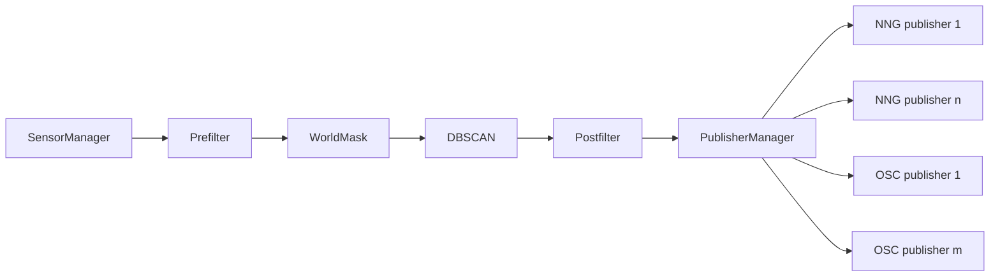

# HokuyoHub 実装計画: Sink 複数宛先化と抽象化（2025-08-18）

要約
- 現状のサーバ実装は NNG と OSC をそれぞれ 1 つしか同時稼働できない（Phase 1）。ランタイム再設定は [RestApi::applySinksRuntime()](src/io/rest_handlers.cpp:1386) が最初の 1 件のみを有効化。
- 目標は、複数の送信先（NNG 複数、OSC 複数）を同時稼働させ、NNG と OSC を抽象化して単一配列として扱うランタイム層を導入する。
- 既に設定モデルは配列に対応済み（[AppConfig::sinks](src/config/config.h:161)）。REST/WS/YAML I/O は現行仕様を維持し、ランタイムのみを多重化・抽象化する。

---

背景と課題
- ランタイム適用
  - 初期適用: [main.cpp](src/main.cpp:56) で起動時に [RestApi::applySinksRuntime()](src/io/rest_handlers.cpp:1386) を 1 回実行。
  - 変更時適用: 追加/更新/削除/ロード/インポート各処理の後で [RestApi::applySinksRuntime()](src/io/rest_handlers.cpp:811) を呼び出し。
- 送信処理
  - 1 スレッドのフレームループからクラスタを配信: [NngBus::publishClusters()](src/io/nng_bus.cpp:111), [OscPublisher::publishClusters()](src/io/osc_publisher.cpp:202) を直接呼出（[main.cpp](src/main.cpp:152)）。
- 制約（Phase 1）
  - [RestApi::applySinksRuntime()](src/io/rest_handlers.cpp:1386) は NNG/OSC それぞれ先頭 1 件のみを起動。複数設定があると警告ログ（[src/io/rest_handlers.cpp](src/io/rest_handlers.cpp:1414)）。
  - 単一インスタンス（[NngBus](src/io/nng_bus.h:11), [OscPublisher](src/io/osc_publisher.h:15)）に紐付け。

---

目標（要件）
1) NNG と OSC の両方で複数の送信先を同時稼働できること
2) プロトコル差異をランタイムで抽象化し、単一配列で一括管理・配信できること
3) 既存 REST/WS/YAML のスキーマを変更せずに達成（互換性維持）
4) ランタイム再設定はホットリロードで適用（全停止→全起動でも可）。将来的に差分適用へ拡張可能な構造
5) 各 Sink 単位での rate_limit を維持（現在の [NngBus](src/io/nng_bus.h:11) / [OscPublisher](src/io/osc_publisher.h:15) と同等の挙動）

非目標
- 既存 UI/API の破壊的変更
- topic によるルーティング高度化（将来拡張）
- 配信パイプラインの分散・非同期化（本フェーズは同一スレッド内で配信）

---

全体アーキテクチャ（案）

- PublisherManager が抽象化した配列（各プロトコルの Publisher インスタンス群）を保持し、publishClusters を一括で扇出
- 再設定時はスレッド安全に配列を差し替える（RCU 風のスワップ）

---

データモデル（設定）
- 設定は現行の配列を継続使用: [AppConfig::sinks](src/config/config.h:161)
  - type: nng|osc
  - 共通: topic, rate_limit
  - nng: url, encoding
  - osc: url, in_bundle, bundle_fragment_size
- 提案（任意・将来拡張）
  - SinkConfig に enabled を追加（YAML/REST/WS も対応）し、一時的無効化を簡易化
  - 本フェーズでは enabled が無くても「存在＝有効」の運用で対応可能

---

ランタイム抽象化設計

新規コンポーネント
- [ISinkPublisher()](src/io/publisher_manager.h:1)
  - 役割: SinkConfig を元に start/stop/publish の共通インターフェースを提供
  - 想定メソッド: start(const SinkConfig&), publishClusters(t_ns, seq, items), stop(), isEnabled()
- [NngSinkPublisher()](src/io/publisher_manager.h:1)
  - 内部に [NngBus](src/io/nng_bus.h:11) を一つ保持し、各 Sink ごとに独立ソケットで配信
- [OscSinkPublisher()](src/io/publisher_manager.h:1)
  - 内部に [OscPublisher](src/io/osc_publisher.h:15) を一つ保持し、各 Sink ごとに独立 UDP 送出
- [PublisherManager](src/io/publisher_manager.h:1)
  - configure(const std::vector<SinkConfig>& sinks)
    - 旧配列を安全に破棄（stop）し、新配列を生成してアトミックに差し替え
    - 生成時に type を見て ISinkPublisher 実装を選択
  - publishClusters(uint64_t t_ns, uint32_t seq, const std::vector<Cluster>& items) const
    - 現在の配列スナップショットを参照して全 Publisher へ扇出
  - stopAll()

スレッド安全性
- フレームループ（[main.cpp](src/main.cpp:79)）から publishClusters が高頻度に呼ばれるため、配列の差し替えはコピーオンライト＋共有ポインタで実装
  - 例: std::shared_ptr<std::vector<std::unique_ptr<ISinkPublisher>>> をメンバーに保持し、configure 完了時に std::atomic_store で差し替え
  - publish は std::atomic_load した共有配列を読み取り専用で走査
- configure は単一スレッド（REST ハンドラ）から呼ぶ前提。将来競合する場合はミューテックスで直列化

エラー耐性
- 一部の Sink が start 失敗しても他は動作を継続（ログで明示）
- configure 結果を要約ログ出力（起動成功数/失敗数）

rate_limit
- Publisher 実装内で従来通り保持。Sink 毎に独立した rate_limit を適用（[NngBus::shouldPublish()](src/io/nng_bus.cpp:96), [OscPublisher::shouldPublish()](src/io/osc_publisher.cpp:101) のロジックを温存）

---

影響範囲と変更点

1) フレームループからの直接呼び出しを置換
- 現状:
  - [main.cpp](src/main.cpp:152) で `ws->pushClustersLite(...)` の後に
  - [NngBus::publishClusters()](src/io/nng_bus.cpp:111), [OscPublisher::publishClusters()](src/io/osc_publisher.cpp:202) へ直接送出
- 変更:
  - [PublisherManager::publishClusters()](src/io/publisher_manager.h:1) を呼ぶ一箇所に集約
  - 既存の nng_bus, osc_publisher 直接呼び出しは削除

2) ランタイム再設定の責務移譲
- 現状:
  - [RestApi::applySinksRuntime()](src/io/rest_handlers.cpp:1386) が単一 NNG/OSC インスタンスを停止→先頭のみ起動
- 変更:
  - RestApi は [PublisherManager](src/io/publisher_manager.h:1) 参照を保持し、`manager.configure(config_.sinks)` を呼ぶ
  - RestApi コンストラクタを変更して [PublisherManager](src/io/publisher_manager.h:1) 参照を追加（[rest_handlers.h](src/io/rest_handlers.h:23) 近辺にメンバ追加）
  - [RestApi::applySinksRuntime()](src/io/rest_handlers.cpp:1386) はラッパ的に `manager.configure(...)` を呼ぶ簡易関数へ差し替え

3) 既存 NngBus / OscPublisher の扱い
- それぞれの Publisher 実装内部で 1 インスタンスずつ保持して利用
- [main.cpp](src/main.cpp:27) の単一インスタンス生成は不要になるため削除
- ただし暫定移行中は `#if` で切替可能にしておく選択肢もあり（段階的移行）

4) スナップショット/REST/WS
- 現状、スナップショットは既に配列を返している（[RestApi::getSnapshot() sinks 配列](src/io/rest_handlers.cpp:1046), [LiveWs::buildSnapshot() publishers.sinks](src/io/ws_handlers.cpp:218)）
- API スキーマ変更は不要
- CRUD エンドポイントは現行のまま（[postSink()](src/io/rest_handlers.cpp:722), [patchSink()](src/io/rest_handlers.cpp:841), [deleteSink()](src/io/rest_handlers.cpp:969), [getSinks()](src/io/rest_handlers.cpp:681)）

---

ホットリロード方式
- 本フェーズ: Stop all → Start all（全停止・全起動）
  - 実装容易、複数 Sink 化後も十分に低コスト（NNG listen, UDP ソケット確立）
- 将来拡張: 差分適用
  - URL 等が不変な Sink は維持し、新設/変更/削除のみ反映
  - 失敗時ロールバック or best-effort 維持の方針検討

---

ロギングと監視
- configure 時:
  - 構成台数、起動成功数、失敗数、各失敗の理由
- publish エラーは Publisher 実装内で rate-limit つき WARN ログ（スパム防止）

---

性能とリソース
- 送出コスト: Sink 数に比例。通常は小規模（数件）想定
- メモリ: Publisher インスタンス数分増加
- 既定は同期送出。送出遅延が問題化する場合は将来スレッド分離・キューイングを検討

---

セキュリティ
- REST の認可は従来通り [RestApi::authorize()](src/io/rest_handlers.cpp:9)
- ソケットバインド先がローカルネットワーク外に露出しないよう設定値をレビュー

---

移行手順（実装オーダー）
1) 新規ファイル追加
   - [publisher_manager.h](src/io/publisher_manager.h:1), [publisher_manager.cpp](src/io/publisher_manager.cpp:1)
   - 抽象 [ISinkPublisher()](src/io/publisher_manager.h:1)、具象 [NngSinkPublisher()](src/io/publisher_manager.h:1)、[OscSinkPublisher()](src/io/publisher_manager.h:1)
2) main の配信経路を切替
   - [main.cpp](src/main.cpp:152) の直接呼出を [PublisherManager::publishClusters()](src/io/publisher_manager.h:1) へ置換
3) RestApi に Manager を注入
   - [rest_handlers.h](src/io/rest_handlers.h:23) コンストラクタとメンバへ PublisherManager 参照を追加
   - [RestApi::applySinksRuntime()](src/io/rest_handlers.cpp:1386) を `manager.configure(config_.sinks)` 呼出に書換
   - 変更箇所からの呼出（[postSink()](src/io/rest_handlers.cpp:722), [patchSink()](src/io/rest_handlers.cpp:841), [deleteSink()](src/io/rest_handlers.cpp:969), [postConfigsLoad()](src/io/rest_handlers.cpp:1135), [postConfigsImport()](src/io/rest_handlers.cpp:1224)）は現状のまま
4) 動作確認（ローカル）
   - 送信先複数を YAML/REST で設定し、同時配信を確認
5) ログ/エラーハンドリングの磨き込み
6) 負荷検証とチューニング（必要に応じて）

---

テスト計画
- 単体テスト（任意）
  - PublisherManager 構成・差替・停止の健全性
  - 失敗した Publisher が混在しても publishClusters が継続する
- 結合テスト
  - scripts の拡張（[scripts/test_rest_api.sh](scripts/test_rest_api.sh:1)）
    - NNG 2 件、OSC 2 件の登録→同時配信の到達確認
    - patch/delete でランタイム反映されるか
- 手動検証
  - NNG クライアント複数で受信、OSC 受信を同時確認
  - rate_limit が Sink 単位で効くこと

---

リスクと対応
- ソケット資源枯渇
  - 異常に多い Sink 数は警告、起動失敗を明示
- 送出時間の増加
  - Sink 数に比例。必要に応じて将来スレッド分離
- 差替時のレース
  - RCU 的差し替えで publish 中クラッシュを回避

---

完了定義 DoD
- 複数 NNG/OSC Sink を同時稼働し、1 フレームで全宛先へ配信される
- REST/WS/YAML スキーマの変更なしで操作可能
- 追加/編集/削除/ロード/インポート後にランタイムへ反映
- 主要ログが意図通り出力され、エラー時も部分稼働を維持

---

変更対象ソース一覧（予定）
- 追加
  - [src/io/publisher_manager.h](src/io/publisher_manager.h:1)
  - [src/io/publisher_manager.cpp](src/io/publisher_manager.cpp:1)
- 変更
  - [src/main.cpp](src/main.cpp:152) 配信呼出を置換、PublisherManager の生成と注入を追加
  - [src/io/rest_handlers.h](src/io/rest_handlers.h:23) PublisherManager 参照メンバとコンストラクタ引数を追加
  - [src/io/rest_handlers.cpp](src/io/rest_handlers.cpp:1386) applySinksRuntime の内部実装を差し替え
- 参照のみ
  - [src/config/config.h](src/config/config.h:161), [src/config/config.cpp](src/config/config.cpp:182)
  - [src/io/nng_bus.h](src/io/nng_bus.h:1), [src/io/nng_bus.cpp](src/io/nng_bus.cpp:1)
  - [src/io/osc_publisher.h](src/io/osc_publisher.h:1), [src/io/osc_publisher.cpp](src/io/osc_publisher.cpp:1)

---

実装インターフェース詳細（ドラフト）

- [ISinkPublisher()](src/io/publisher_manager.h:1)
  - start(const SinkConfig& cfg) - 失敗時は false を返すか enabled=false 内部設定
  - publishClusters(uint64_t t, uint32_t seq, const std::vector<Cluster>& items)
  - stop()
  - isEnabled() const

- [NngSinkPublisher()](src/io/publisher_manager.h:1)
  - メンバ: NngBus bus_
  - start で bus_.startPublisher(cfg)、publish で bus_.publishClusters(...)

- [OscSinkPublisher()](src/io/publisher_manager.h:1)
  - メンバ: OscPublisher osc_
  - start で osc_.start(cfg)、publish で osc_.publishClusters(...)

- [PublisherManager](src/io/publisher_manager.h:1)
  - bool configure(const std::vector<SinkConfig>& sinks)
    - 新規ベクタをローカルで構築し、各要素 start
    - 任意の失敗をログに積んだうえでアトミックに差し替え
    - 旧ベクタを安全に stop して破棄
  - void publishClusters(uint64_t t, uint32_t seq, const std::vector<Cluster>& items) const
    - 現在のスナップショットを for-each で扇出
  - void stopAll()

---

参考：現行実装（Phase 1）の要点
- 単一化の根拠: [RestApi::applySinksRuntime()](src/io/rest_handlers.cpp:1386) が NNG/OSC それぞれ先頭 1 件のみを適用
- 配信入口: [main.cpp](src/main.cpp:152) で直接 [NngBus::publishClusters()](src/io/nng_bus.cpp:111), [OscPublisher::publishClusters()](src/io/osc_publisher.cpp:202) を呼び分け
- 配列設定は既に I/O 済（[load_app_config() sinks](src/config/config.cpp:182), [dump_app_config() sinks](src/config/config.cpp:340)）
