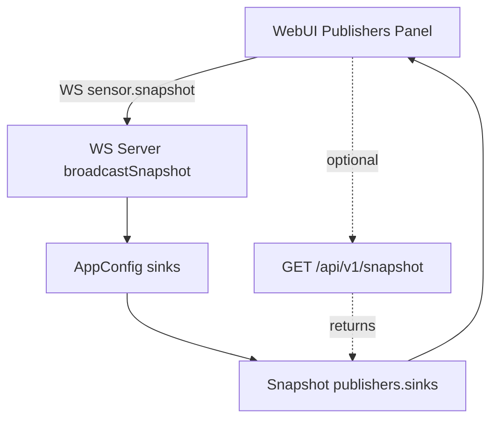

# 実装計画: Sink情報をブラウザに表示

目的
- 管理者/ユーザーが現在の出力先(Sink/Publisher)設定をWebブラウザ上で把握できるようにする
- 既存のRESTエンドポイントとUI構造を活用し、最小追加で導入
- 将来の拡張(複数Sinkの同時可視化、ランタイム状態表示)に繋がる構成にする

現状の把握
- サーバ側はスナップショットAPIでpublishers情報を返却している
  - 参照: [RestApi::getSnapshot()](src/io/rest_handlers.cpp:266)
  - publishersセクションの生成は以下の箇所で実施
    - NNG: type==nngで url, topic, encoding, rate_limit を格納 [RestApi::getSnapshot()](src/io/rest_handlers.cpp:290)
    - OSC: type==oscで url, rate_limit を格納 [RestApi::getSnapshot()](src/io/rest_handlers.cpp:303)
  - publishersの構造は現在、型ごとのオブジェクト(nng, osc)をトップレベルに持つマップ形式。複数エントリがある場合は後勝ち(上書き)となる可能性がある(配列ではない)
- Sinkの設定元はアプリ設定(AppConfig)のsinks配列
  - 参照: [AppConfig](src/config/config.h:134), Sink定義 [SinkConfig](src/config/config.h:50)
  - 読み込み/書き出し: [config.cpp](src/config/config.cpp:183), [config.cpp](src/config/config.cpp:329)
- 実行時のPublisher実装
  - NNG: [NngBus::startPublisher(const SinkConfig&)](src/io/nng_bus.cpp:52)
  - OSC: [OscPublisher::start](src/io/osc_publisher.cpp:17)
- WebUIは現在、センサー可視化/フィルター設定やコンフィグ操作UIを持つが、Publishers/Sinksの表示は未実装
  - 参照: [webui/index.html](webui/index.html), [webui/app.js](webui/app.js)

スコープ(今回リリース範囲)
- WebUIに「Publishers」パネルを追加し、/api/v1/snapshotのpublishers情報を人が読める形式で表示
  - NNG: enabled, url, topic, encoding, rate_limit
  - OSC: enabled, url, rate_limit
- 手動更新ボタンと、数秒間隔の自動ポーリング(例: 5秒)を実装 -> 更新されたらサーバからWSで通知がくるため不要
- エラー時に軽量な通知を表示(既存のshowNotification再利用)
- 認証はスナップショットで不要(現行実装ではauthorize未使用)だが、将来のためヘッダ付与対応の拡張余地を残す
- publishersを配列構造に変更して複数Sinkを正確に列挙
  - 提案: snapshot.publishers.sinks: [ {type, url, topic?, encoding?, rate_limit, enabled}, ...]
  - 実装位置: [RestApi::getSnapshot()](src/io/rest_handlers.cpp:290) 近辺
- ランタイム状態(送信件数/秒、直近送信時刻、有効フラグ)の可視化
  - NngBus, OscPublisherクラスから状態参照を追加し、Snapshotへ掲載
    - 参考: [NngBus](src/io/nng_bus.h:26), [OscPublisher](src/io/osc_publisher.h:29)

UI/UX要件
- Sensors/Filterセクションと同等の簡潔なカード/テーブル表示
- 項目: Type, Enabled, URL, Topic, Encoding, RateLimit(Hz)
- 手動更新ボタン(Refresh) -> 不要
- 自動更新のON/OFFトグル(初期ON, 5秒間隔) -> 不要
- 取得失敗時は上部通知にエラーを表示。前回取得値は保持(ちらつきを避ける)

APIおよびデータ構造
- 取得: GET /api/v1/snapshot
  - 参照: [RestApi::getSnapshot()](src/io/rest_handlers.cpp:266)
- 期待レスポンス例(現状の構造)
  {
    publishers: {
      nng: { enabled: true, url: "tcp://0.0.0.0:5555", topic: "clusters", encoding: "msgpack", rate_limit: 120 },
      osc: { enabled: true, url: "osc://127.0.0.1:7000/hokuyohub/cluster", rate_limit: 60 }
    }
  }

実装方針(詳細)
1. サーバ変更(本スコープに含める)
   - RESTスナップショットのpublishersを配列化
     - 形式: `snapshot.publishers.sinks: [ { type, url, topic?, encoding?, rate_limit, enabled }, ... ]`
     - 実装: [RestApi::getSnapshot()](src/io/rest_handlers.cpp:266) 内のpublishers構築処理を以下に変更
       - `config_.sinks` を全走査し、各 `SinkConfig` から要素を生成 [SinkConfig](src/config/config.h:50)
       - `enabled` は従来の有効フラグ判定(型別有効性やビルドフラグ)に基づき設定
       - 後方互換性のため、旧形式(`publishers.nng`, `publishers.osc`)は当面維持し、同一内容を1件代表で残す
       - 最終的にWebUIは配列形式のみを参照
     - 参照箇所: publishers生成ブロック [RestApi::getSnapshot()](src/io/rest_handlers.cpp:290)
   - WebSocketスナップショットへも同等のpublishers.sinksを含める
     - 実装: LiveWs側のスナップショット送信(例: broadcastSnapshot相当)にpublishers.sinksを追加
     - 参考: コンフィグLoad/Import時に [postConfigsLoad](src/io/rest_handlers.cpp:377), [postConfigsImport](src/io/rest_handlers.cpp:463) から `ws_->broadcastSnapshot()` が呼ばれている
     - 目的: ブラウザは手動/自動ポーリング不要で、WSイベントだけで最新表示へ更新可能

2. WebUI 変更
   - index.html
     - Panelセクション配下に「Publishers」パネルを追加
       - コンテナ: `
`
       - テーブル: 列は Type, Enabled, URL, Topic, Encoding, RateLimit
       - RefreshボタンやAuto Refreshトグルは追加しない
     - 参照: [webui/index.html](webui/index.html)
   - app.js
     - publishers表示用のレンダリング関数を追加: `renderPublishers(sinksArray)`
     - WebSocketメッセージで `sensor.snapshot` 等に `publishers.sinks` が含まれていれば、それを用いて即時描画
       - 既存の接続時要求: `ws.send({type:'sensor.requestSnapshot'})` 後に受信するスナップショットで描画開始 [webui/app.js](webui/app.js)
       - Config Load/Import完了時の `ws_->broadcastSnapshot()` により自動更新
     - RESTのfetchやsetIntervalによるポーリングは実装しない
     - エラー時は既存の `showNotification` を用いた通知のみ(任意)
     - 参照: [webui/app.js](webui/app.js)

3. テスト
   - REST API
     - [scripts/test_rest_api.sh](scripts/test_rest_api.sh) の `/api/v1/snapshot` テストに `publishers.sinks` 配列の存在確認を追加(任意)
     - configsの複数sinksパターンで配列に複数要素が返ることを確認
     - 参考設定: [configs/example_with_features.yaml](configs/example_with_features.yaml)
   - 手動確認(ブラウザ)
     - nngのみ/oscのみ/両方/複数nngの各ケースで、Publishersパネルが配列の全要素を表示すること
     - Configs Load/Import後に自動で最新内容へ更新されること

受け入れ基準(AC)
- RESTの `/api/v1/snapshot` レスポンスに `publishers.sinks` が存在し、全sinksが配列で列挙されること
  - 各要素が type, enabled, url, topic(任意), encoding(任意), rate_limit を含むこと
  - 旧形式(`publishers.nng`, `publishers.osc`)も当面は併存(後方互換)
- WebUIに「Publishers」パネルが追加され、`publishers.sinks` の全要素がテーブル表示されること
- 手動更新/自動ポーリングを実装せずとも、WebSocket経由のスナップショット通知で最新状態に更新されること
- configsのLoad/Import後、Publishers表示が自動で最新化されること

変更点一覧
- サーバ
  - [RestApi::getSnapshot()](src/io/rest_handlers.cpp:266) のpublishers生成を配列化し、旧形式は互換目的で保持
  - LiveWsによるスナップショット送信処理(WS)へ `publishers.sinks` を追加(該当箇所: ws_handlers系)
- WebUI
  - [webui/index.html](webui/index.html) にPublishersパネルを追加(ボタン/ポーリング無し)
  - [webui/app.js](webui/app.js) に `renderPublishers()` と WS受信ハンドラの拡張を追加

将来拡張提案
- publishers配列要素へランタイム状態(送信数/秒、直近送信時刻、実接続状態)を追加
  - 参照点: [NngBus](src/io/nng_bus.h:26), [OscPublisher](src/io/osc_publisher.h:29)
- WebUIで詳細ドロワー/フィルタリング(タイプ別)を提供

想定工数
- サーバ改修 + WebUI実装/試験: 1.0〜1.5日
- ランタイム計測の導入(将来): 1.0〜2.0日

リスク/留意点
- API変更(配列化)はクライアント影響があるため、旧形式を一定期間は併存させる
- WSスナップショットにpublishersを確実に含めるため、ws_handlers側の構造統一に注意

Mermaid(データフロー)

参考リンク
- スナップショット生成: [RestApi::getSnapshot()](src/io/rest_handlers.cpp:266)
- publishers配列化対象: [RestApi::getSnapshot()](src/io/rest_handlers.cpp:290)
- 設定モデル: [SinkConfig](src/config/config.h:50), [AppConfig](src/config/config.h:134)
- Publisher実装: [NngBus::startPublisher(const SinkConfig&)](src/io/nng_bus.cpp:52), [OscPublisher::start](src/io/osc_publisher.cpp:17)
- WebUI: [webui/index.html](webui/index.html), [webui/app.js](webui/app.js)