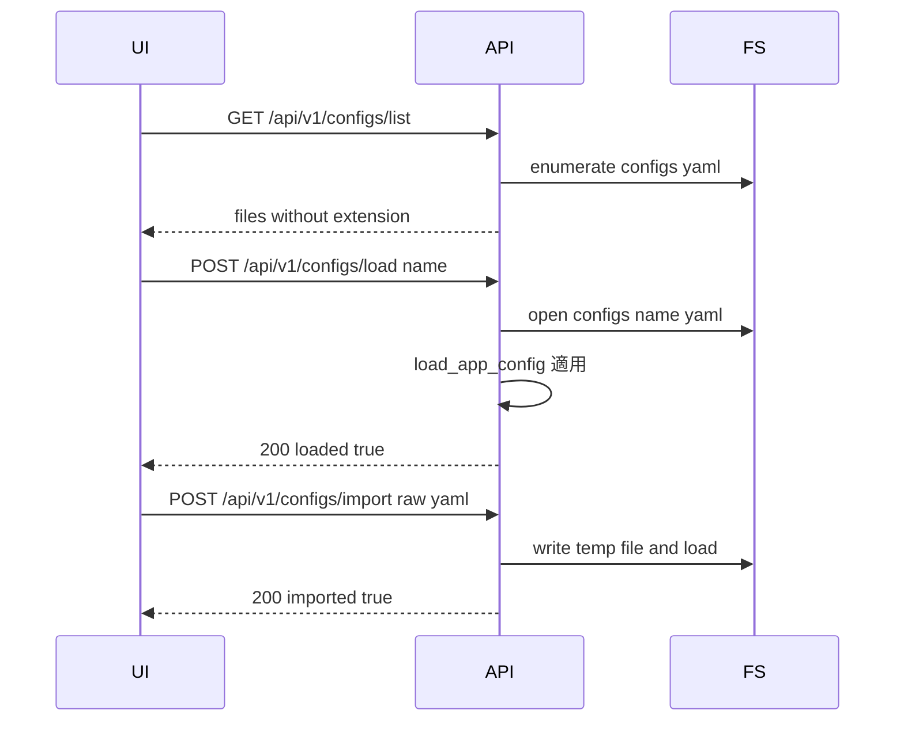

# ブラウザ機能の拡充 実装計画

概要
- 本計画は [docs/implementation-plans.md](docs/implementation-plans.md) の「ブラウザ機能の拡充」に記載されたTODOの実装方針を定義します。実装はこの計画の承認後に着手します。
- 対象機能
  - スケール表示の更新（ホイール/キー操作即時反映）
  - グリッドに数値ラベルを描画（スケールに応じて間引き）
  - Save/Load/Export/Import 機能の改修（.yaml 自動付与、サーバ側ファイル一覧、ImportのUI追加）

関連ファイル
- フロントエンド
  - [webui/index.html](webui/index.html:33)
  - [webui/app.js](webui/app.js:1)
  - [webui/styles.css](webui/styles.css:1)
- バックエンド（REST）
  - [RestApi::postConfigsLoad()](src/io/rest_handlers.cpp:335)
  - [RestApi::postConfigsImport()](src/io/rest_handlers.cpp:388)
  - [RestApi::postConfigsSave()](src/io/rest_handlers.cpp:434)
  - [RestApi::getConfigsExport()](src/io/rest_handlers.cpp:483)
  - [src/io/rest_handlers.h](src/io/rest_handlers.h:41)
- WebSocket（参考）
  - [LiveWs::sendSnapshotTo()](src/io/ws_handlers.cpp:145)

1. スケール表示の更新
背景
- 現状、スケール表示は [updateViewportInfo()](webui/app.js:1782) が定期更新で反映されますが、ユーザ操作直後の即時性が不足しています。

要件
- マウスホイールでのズーム時、プラス/マイナスキーでのズーム時、リセット時に即時更新する。

変更方針（フロントエンド）
- マウスホイールズームのハンドラ [webui/app.js](webui/app.js:1521) 内で、viewport.scale 更新後に [updateViewportInfo()](webui/app.js:1782) を呼ぶ。
- キーイベントハンドラ [webui/app.js](webui/app.js:1547) 内の +/- 処理後にも [updateViewportInfo()](webui/app.js:1782) を呼ぶ。
- 既存の定期更新はフォールバックとして維持。

受け入れ基準
- ホイールズームや +/- キー操作に対し、スケール表示が1秒未満の遅延で即時更新される。

2. グリッドに数値を記入する（適度に間引く）
背景
- グリッドは [drawGrid()](webui/app.js:311) で描画されますが、数値ラベルは未表示です。

要件
- メートル単位のラベルを描画。
- ビューポートスケールに応じてラベル密度を自動調整し、視認性を確保。

変更方針（フロントエンド）
- [drawGrid()](webui/app.js:311) を拡張:
  - 補助関数 chooseGridStepMeters(scalePxPerMeter) を追加し、{0.1, 0.2, 0.5, 1, 2, 5, 10, ...} から選択。条件: step_m * viewport.scale >= 80px 目安。
  - キャンバス中心座標(cx, cy)とスケールから表示範囲内の垂直・水平グリッド位置を世界座標で計算し、可視範囲のみ描画。
  - ラベルは原点軸付近に小さな等幅フォントで描画し、コントラストを確保（例: #ddd, 12px, globalAlpha 0.8）。
  - 最低間隔(minLabelPx=80)を満たさない場合はスキップし重なりを防止。
- パフォーマンス: 画面内のラベルのみ計算し、毎フレームのオーバーヘッドを抑える。

受け入れ基準
- 任意のズームでもラベルが過密にならず、読みやすい。
- ズームインで密、ズームアウトで疎になる自然な挙動。

3. Save/Load/Export/Import 機能の改修
背景
- 既存APIは揃っているものの、UIUXに以下の改善余地:
  - Save: ファイル名に .yaml を付けずに保存したい
  - Load: サーバ上の既存ファイル一覧から選択したい
  - Export: 現状維持
  - Import: クライアントからアップロードして反映（UIから可能に）

3.1 REST API 変更設計
- 新規: 設定ファイル一覧取得
  - GET /api/v1/configs/list
  - 挙動: configs ディレクトリ配下の *.yaml を列挙し、拡張子を除いた name を返す
  - レスポンス例:
    - { "files": ["default", "example_with_features", "smoke_test"] }
  - 実装: [src/io/rest_handlers.h](src/io/rest_handlers.h:41) にメソッドを追加し、[src/io/rest_handlers.cpp](src/io/rest_handlers.cpp:483) 付近に実装を追加。std::filesystem を使用。
  - 認可: [authorize()](src/io/rest_handlers.cpp:7) を適用（トークン未設定時は誰でも取得可）。
- 変更: 保存
  - POST /api/v1/configs/save
  - リクエスト: { "name": "my_config" } を使用。以前の { "path": "configs/foo.yaml" } は廃止
  - サーバ動作:
    - "name" を受けた場合は "configs/<name>.yaml" に保存
    - name は [A-Za-z0-9_-]+ のみ許可し、それ以外は 400
    - dump は [dump_app_config()](src/config/config.cpp:208)
  - 既存実装ベース: [RestApi::postConfigsSave()](src/io/rest_handlers.cpp:434)
- 変更: 読込
  - POST /api/v1/configs/load
  - リクエスト: { "name": "my_config" } を使用。以前の { "path": "configs/foo.yaml" } は廃止
  - サーバ動作:
    - "name" を受けた場合は "configs/<name>.yaml" をロードして config_ に適用
    - load は [load_app_config()](src/config/config.cpp:19)
  - 既存実装ベース: [RestApi::postConfigsLoad()](src/io/rest_handlers.cpp:335)
- 既存維持: エクスポート
  - GET /api/v1/configs/export
  - 既存実装: [RestApi::getConfigsExport()](src/io/rest_handlers.cpp:483)
- 既存維持: インポート
  - POST /api/v1/configs/import
  - リクエストボディ: YAML テキスト（Content-Type: text/plain を想定）
  - 既存実装: [RestApi::postConfigsImport()](src/io/rest_handlers.cpp:388)

3.2 バックエンド実装方針
- [src/io/rest_handlers.h](src/io/rest_handlers.h:41) に list 用メソッド宣言と METHOD_LIST 追加。
- [src/io/rest_handlers.cpp](src/io/rest_handlers.cpp:434) の Save で "name" を使用、".yaml" 自動付与。legacy "path" は廃止。
- [src/io/rest_handlers.cpp](src/io/rest_handlers.cpp:335) の Load で "name" を使用、configs/<name>.yaml をロード。
- list 実装は std::filesystem で configs ディレクトリ直下の *.yaml を列挙し、拡張子を除いて返却。
- いずれも [authorize()](src/io/rest_handlers.cpp:7) による認可を適用（書込操作は必須、list は任意だが揃える）。

3.3 フロントエンド実装方針
- index.html
  - Config ボタン群に Import を追加: [webui/index.html](webui/index.html:33)
- app.js
  - Save: [saveCurrentConfiguration()](webui/app.js:1816) を修正し、名前入力から ".yaml" を除去して {name} で POST。結果表示は既存の通知を流用。
  - Load: [loadConfiguration()](webui/app.js:1849) をダイアログからの直接入力ではなく、GET /api/v1/configs/list の結果を選択UIで提示し {name} で POST。簡易モーダルまたは prompt の選択式で暫定対応可。
  - Export: 既存 [exportConfiguration()](webui/app.js:1884) を維持。
  - Import: 新規ボタン id=btn-import-config をトリガに、hidden の input type=file を用い、FileReader でテキスト化して /api/v1/configs/import に POST。成功で ws の snapshot 要求を送信。
- セキュリティ
  - config.security.api_token 設定時は Authorization ヘッダを付与できるよう拡張余地を残す（今回の実装範囲外）。サーバ側は既存の authorize に準拠。

3.4 API I/O 例
- 保存
  - リクエスト: POST /api/v1/configs/save { "name": "my_config" }
  - レスポンス: { "saved": true, "name": "my_config", "bytes": 12345 }
- 読込
  - リクエスト: POST /api/v1/configs/load { "name": "my_config" }
  - レスポンス: { "loaded": true, "name": "my_config", "message": "Configuration loaded successfully" }
- 一覧
  - リクエスト: GET /api/v1/configs/list
  - レスポンス: { "files": ["default","example_with_features","my_config"] }
- インポート
  - リクエスト: POST /api/v1/configs/import （ボディ: YAML テキスト）
  - レスポンス: { "imported": true, "message": "Configuration imported successfully" }

4. テスト計画
- スクリプト: [scripts/test_rest_api.sh](scripts/test_rest_api.sh:123) を拡張
  - 追加: GET /api/v1/configs/list の検証
  - 追加: POST /api/v1/configs/save {"name":"smoke_test"} → 正常
  - 追加: POST /api/v1/configs/load {"name":"smoke_test"} → 正常
  - 追加: 異常系 name に不正文字 → 400 を確認
  - 既存: export, import, save(path), load(path) の後方互換を維持
- 手動テスト
  - フロントから Save/Load/Export/Import 操作の一連動作
  - スケール表示の即時更新（ホイール、+/-、リセット）
  - グリッド数値ラベルの視認性（ズームイン・アウト）

5. 互換性と移行
- 既存の path 指定による Save/Load は廃止。
- リストAPIは新設だが、UIからのみ使用。外部ツールへの影響は無し。

6. 想定工数目安
- フロント: 0.7日（スケール即時更新 0.1、グリッドラベリング 0.3、Save/Load/Import UI 0.3）
- バックエンド: 0.5日（list 新設 0.2、save/load 拡張 0.2、スクリプト更新 0.1）
- テスト・調整・レビュー: 0.5日

7. リスク・留意点
- ファイル名バリデーション: ディレクトリトラバーサル防止のため "configs/" 固定、name は英数とハイフン・アンダースコアのみ許可。
- 権限: 認可トークン設定時は UI 側で Authorization ヘッダ対応が必要（本タスク外）。サーバ側は既存 [authorize()](src/io/rest_handlers.cpp:7) に準拠。
- パフォーマンス: グリッドラベルは可視範囲に限定し、毎フレームの計算を軽量化。

8. 実装手順（チェックリスト）
- バックエンド
  - [ ] [src/io/rest_handlers.h](src/io/rest_handlers.h:41) に list エンドポイント宣言と METHOD_LIST 追加
  - [ ] [src/io/rest_handlers.cpp](src/io/rest_handlers.cpp:335) Load の name 対応
  - [ ] [src/io/rest_handlers.cpp](src/io/rest_handlers.cpp:434) Save の name 対応と .yaml 自動付与
  - [ ] [src/io/rest_handlers.cpp](src/io/rest_handlers.cpp:483) 付近に list 実装を追加
  - [ ] [scripts/test_rest_api.sh](scripts/test_rest_api.sh:123) を更新
- フロントエンド
  - [ ] [webui/index.html](webui/index.html:33) に Import ボタンを追加
  - [ ] [webui/app.js](webui/app.js:1816) Save を name ベースに変更
  - [ ] [webui/app.js](webui/app.js:1849) Load を list 取得→選択→name でPOSTに変更
  - [ ] [webui/app.js](webui/app.js:1521) ホイール後に [updateViewportInfo()](webui/app.js:1782) 呼び出し
  - [ ] [webui/app.js](webui/app.js:1547) +/- 後に [updateViewportInfo()](webui/app.js:1782) 呼び出し
  - [ ] [drawGrid()](webui/app.js:311) に数値ラベル描画と間引き処理を追加

9. シーケンス図（Load と Import）

10. 承認後の進め方
- 本ファイルの内容で差異がなければ、Code モードに切替えて実装を開始します。
- 実装中は本計画のチェックリストに沿って進捗を更新します。