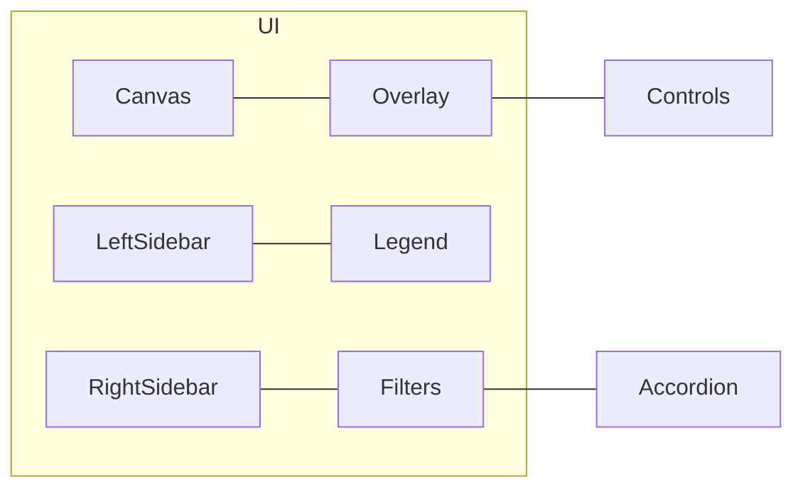

# HokuyoHub レイアウト修正 実装計画

対象TODO: 「レイアウト修正」  
本計画は UI のオーバーレイ配置と Filter Configuration のアコーディオン対応を、既存構成に最小限の影響で導入するための実装指針を示します。実装は本計画の承認後に着手してください。

## 1. 要求仕様の要約（合意事項）
- オーバーレイ: 左上固定・常時表示
- 含める操作:
  - Show Raw Points, Show Filtered Data, Per-sensor Colors
  - Viewport: Reset View, Scale 表示
  - ROI: + Include Region, + Exclude Region, Clear All ROI
  - 操作説明（Instructions）
- レジェンドは左サイドバーのまま
- アコーディオン: Filter Configuration は「セクション単位のみ」を折りたたみ（strategy-group は常時展開）

## 2. 現状把握（抜粋）
- コントロール配置
  - キャンバス上部のバー: Viewport/ROI/Config/Instructions は [webui/index.html](webui/index.html) の行 20–44 にある `.viewport-controls` 内
  - 表示トグル（Show Raw/Filtered/Per-sensor Colors）は左サイドバーの Sensors セクション内 `.display-controls`（行 58–71）
  - キャンバスは [webui/index.html](webui/index.html) 行 123–125 の `#center-canvas` に配置
- イベントと依存:
  - 既存のハンドラは ID ベースで参照しているため、要素の移動のみで多くは動作継続
    - 表示トグル: `#show-raw-points, #show-filtered-data, #per-sensor-colors`
    - Viewport/ROI: `#btn-reset-viewport, #viewport-info, #btn-create-include, #btn-create-exclude, #btn-clear-roi, #roi-instructions`
  - ビューポート情報更新は [updateViewportInfo()](webui/app.js:1965) が担当
  - キャンバス描画は [redrawCanvas()](webui/app.js:209)、リサイズは [resize()](webui/app.js:78)
- Filter Configuration の DOM は `#filter-panel` 内に `filter-section`（Prefilter/Postfilter）と `strategy-group` が配されている（行 169 以降）

## 3. 実装全体方針
- 「移動・再配置優先」: 既存 ID・イベントハンドラを活かし、DOM を所定のオーバーレイ領域へ移設する
- 「表示のみ制御」: アコーディオンは見た目の開閉に限定し、内部有効/無効ロジック（[updateFilterUIState()](webui/app.js:1205)）には影響しない
- 「ヒットテスト配慮」: オーバーレイのルートには `pointer-events: none`、実体コントロールには `pointer-events: auto` を適用し、下のキャンバス操作（ドラッグ/ホイール）を阻害しない

## 4. 変更点（ファイル別）

### 4.1 [webui/index.html](webui/index.html)
- `#center-canvas` 内にオーバーレイ用のコンテナを追加（左上固定）
  - 例: 
    - <div class="canvas-overlay">
      - <div class="overlay-row">…表示トグル…</div>
      - <div class="overlay-row">…Viewport…</div>
      - <div class="overlay-row">…ROI…</div>
      - <div class="overlay-row help">…Instructions…</div>
    - </div>
- `.viewport-controls` バー（行 20–44）は廃止（計画中は HTML コメント化または CSS で非表示）し、同内容をオーバーレイへ移設
- 左サイドバーの `.display-controls`（行 58–71）はオーバーレイへ移設（ID は維持）
- レジェンド（`#legend`）は移動せず、左サイドバーに残す

注意:
- ID 重複防止のため、**移設は「実体の移動」**（複製ではない）
- ヘルプテキスト `#roi-instructions` はオーバーレイ内に配置（ID は現状どおり）

### 4.2 [webui/styles.css](webui/styles.css)
- 新規スタイル:
  - `.canvas-overlay`
    - 位置: `position: absolute; top: 8px; left: 8px;`
    - レイヤ: `z-index: 5`（キャンバス上の UI として十分）
    - ヒットテスト: ルートに `pointer-events: none`
  - `.canvas-overlay .overlay-row`
    - レイアウト: `display: flex; gap: 8px; align-items: center;`
    - 見た目: 小型ボタン/チェックの並び、背景半透明（例: `background: rgba(248,249,250,.9)`）、角丸、枠線
    - ヒットテスト: `pointer-events: auto`
  - レスポンシブ:
    - 幅が狭い場合は行を自動折返し（`flex-wrap: wrap`）し、視認性を確保
- 既存 `.viewport-controls` の可視性を切替可能に（後方互換/ロールバック目的）
  - 例: デフォルトで `display: none;` にし、緊急時に有効化できるユーティリティクラスを用意
- Filter Configuration のアコーディオン:
  - `.filter-section.collapsed .filter-content { display: none; }`
  - セクションヘッダ内のトグルボタン（アイコン）装飾
  - 既存の有効/無効（disabled/opacity）はそのまま維持

### 4.3 [webui/app.js](webui/app.js)
- 基本方針: 既存 ID を維持して DOM を移動するため、多くのイベントハンドラは変更不要
- 影響確認（関数/処理の非機能影響を避ける）
  - [resize()](webui/app.js:78): キャンバスサイズは `#center-canvas` のレイアウト依存。オーバーレイは絶対配置であり、領域計測への影響なし
  - [redrawCanvas()](webui/app.js:209): 描画はキャンバスのみでオーバーレイには依存しない
  - [updateViewportInfo()](webui/app.js:1965): 移設後も `#viewport-info` は存在するため動作継続
- アコーディオン追加:
  - セクションヘッダ（`#filter-panel` 配下の `.filter-section > h3`）にクリック/キーボード（Space/Enter）で `collapsed` をトグル
  - ヘッダに `aria-expanded`, `aria-controls` を付与し、対応する `.filter-content` を制御
  - 既存の [updateFilterUIState()](webui/app.js:1205) と [setupFilterEventListeners()](webui/app.js:1343) は流用。折りたたみは見た目のみ（有効/無効はこれまで通りチェックボックスで制御）
- ヒットテスト:
  - オーバーレイの親に `pointer-events: none` を適用し、子（ボタン/チェック）にのみ `pointer-events: auto` を適用することで、オーバーレイ外のキャンバス操作（ドラッグ/ホイール）を阻害しない

## 5. 具体的な変更手順（概要）

### 手順A: オーバーレイ DOM の導入
1) [webui/index.html](webui/index.html)
   - `<main id="center-canvas" ...>`（行 123 付近）直下に:
     - `<div class="canvas-overlay">` を追加
     - 4 行構成:
       - 行1: 表示トグル（3 チェック）
       - 行2: Viewport（Reset/Scale）
       - 行3: ROI（Include/Exclude/Clear）
       - 行4: Instructions（テキスト）
   - `.viewport-controls`（行 20–44）は段階的廃止
     - 初期は HTML コメント化し、挙動検証後に削除
   - 左サイドバー `.display-controls`（行 58–71）をオーバーレイへ「移動」
     - サイドバーからは削除（ID 重複防止）

2) [webui/styles.css](webui/styles.css)
   - `.canvas-overlay` と `.overlay-row` のスタイルを追加
   - `.viewport-controls` は `display: none;`（ロールバック用に切替クラスを残す）

3) [webui/app.js](webui/app.js)
   - 変更不要（ID 同一のため）。動作検証で必要なら微調整

### 手順B: Filter Configuration（セクション単位）のアコーディオン
1) [webui/index.html](webui/index.html)
   - Prefilter セクション（行 177 付近）と Postfilter セクション（行 293 付近）で、`<h3>…</h3>` 直後から末尾までを `<div class="filter-content">…</div>` で包む
   - `<h3>` 内にトグルボタン（アイコン）を追加可能（ボタンは任意、`h3` 自体にクリックリスナでも可）
   - 各セクションの enable チェックは `h3` 内に残し、折りたたみ中でも操作可能にする

2) [webui/styles.css](webui/styles.css)
   - `.filter-section.collapsed .filter-content { display: none; }` 追加
   - ヘッダの見た目（ホバー/フォーカス、カーソル、開閉アイコン）を調整

3) [webui/app.js](webui/app.js)
   - `DOMContentLoaded` 内で、`#filter-panel .filter-section > h3` に click/keydown を付与
   - 状態はページ滞在中のみ保持（localStorage はスコープ外）

## 6. アクセシビリティ/操作性
- キーボード:
  - セクションヘッダに `tabindex="0"` を付与し、Space/Enter で `collapsed` 切替
- ARIA:
  - ヘッダ: `aria-expanded="true|false"`, `aria-controls="section-id"`
  - コンテンツ: `id="section-id"`, `role="region"` を付与
- フォーカスインジケータを CSS で明確化
- オーバーレイ内のボタン/チェックは標準のフォーカス移動順に従う

## 7. テスト計画
- レイアウト/操作
  - デスクトップ/モバイル（幅 400px, 600px, 1024px, 1440px など）で視認性と折返し確認
  - キャンバス操作: オーバーレイ領域上/外でのドラッグ/ズーム。ヒットテストが期待どおりか（下地のキャンバスを阻害しない）
  - ROI 作成/編集フローと案内テキストの常時視認性
- 表示トグルとレジェンド
  - 3 トグルの切替による描画パス/凡例表示の整合性（per-sensor colors 時の凡例表示）
- ビューポート
  - Reset/Scale 表示の動作、[updateViewportInfo()](webui/app.js:1965) の更新タイミング
- アコーディオン
  - Prefilter/Postfilter を個別に開閉
  - 折りたたみ中でも enable チェックは操作可
  - [updateFilterUIState()](webui/app.js:1205) の無効化視覚は維持
- パフォーマンス
  - 大規模点群受信中でもフレーム落ちが許容範囲（`performanceMode` オン/オフで相違なし）
- 回帰
  - [resize()](webui/app.js:78), [redrawCanvas()](webui/app.js:209) の動作に変化なし
  - WebSocket 受信ハンドラ（snapshot/filter/world/dbscan）への副作用なし

## 8. 受け入れ条件（Acceptance Criteria）
- オーバーレイが左上に常時表示され、要求の全コントロールが含まれる
- キャンバスのドラッグ/ホイール操作がオーバーレイ導入後も成立
- Filter Configuration の Prefilter と Postfilter がセクション単位で開閉可能
- 折りたたみ状態でも enable チェックは操作可能
- レジェンドはサイドバーに残り、per-sensor colors 時に表示制御が機能
- 既存機能（描画、ROI 操作、センサー移動/回転、設定保存/読込/入出力など）に回帰不具合がない

## 9. ロールバック/移行
- `.viewport-controls` は当面コメントアウトで残置。CSS で再表示可能
- オーバーレイは `display: none;` を当てることで旧バーに即時復帰
- アコーディオン付与は CSS で `.filter-section.collapsed` を外せば元表示に戻る

## 10. 変更点の擬似差分（実装時の道標）

注: 正式な差分は PR で提示。ここでは挿入位置と概形のみ。

- [webui/index.html](webui/index.html)
  - `<main id="center-canvas">` 直下:
    ```
    <div class="canvas-overlay">
      <div class="overlay-row">
        <label class="control-item"><input type="checkbox" id="show-raw-points"><span>Show Raw Points</span></label>
        <label class="control-item"><input type="checkbox" id="show-filtered-data"><span>Show Filtered Data</span></label>
        <label class="control-item"><input type="checkbox" id="per-sensor-colors"><span>Per-sensor Colors</span></label>
      </div>
      <div class="overlay-row">
        <button id="btn-reset-viewport" type="button">Reset View</button>
        <span id="viewport-info">Scale: 60px/m</span>
      </div>
      <div class="overlay-row">
        <button id="btn-create-include" type="button" class="roi-btn">+ Include Region</button>
        <button id="btn-create-exclude" type="button" class="roi-btn">+ Exclude Region</button>
        <button id="btn-clear-roi" type="button" class="roi-btn">Clear All ROI</button>
      </div>
      <div class="overlay-row help">
        <span id="roi-instructions">Pan: Drag | Zoom: Wheel | Sensors: Drag to move, R to rotate | ROI: Click points, Enter to finish</span>
      </div>
    </div>
    ```
  - 旧 `.viewport-controls` はコメントアウト
  - サイドバー内 `.display-controls` は削除（オーバーレイへ移設）

- [webui/styles.css](webui/styles.css)
  ```
  .center-canvas { position: relative; } /* オーバーレイの絶対配置に必要 */

  .canvas-overlay {
    position: absolute;
    top: 8px;
    left: 8px;
    display: grid;
    gap: 6px;
    z-index: 5;
    pointer-events: none;
  }
  .canvas-overlay .overlay-row {
    display: flex;
    gap: 8px;
    align-items: center;
    background: rgba(248,249,250,.9);
    border: 1px solid #dee2e6;
    border-radius: 6px;
    padding: 6px 8px;
    pointer-events: auto;
  }
  .canvas-overlay .overlay-row.help {
    font-size: 11px;
    color: #6c757d;
  }

  .viewport-controls { display: none; } /* ロールバック用に残置 */

  /* アコーディオン */
  .filter-section .filter-content { margin-top: 8px; }
  .filter-section.collapsed .filter-content { display: none; }
  .filter-section > h3 { display: flex; align-items: center; justify-content: space-between; cursor: pointer; }
  .filter-section > h3 .toggle-caret { margin-left: 8px; font-size: 12px; opacity: .7; }
  ```

- [webui/app.js](webui/app.js)
  - `DOMContentLoaded` で以下の初期化を追加（概略）:
    ```
    // アコーディオン初期化
    const filterSections = document.querySelectorAll('#filter-panel .filter-section');
    filterSections.forEach((sec, idx) => {
      const header = sec.querySelector('h3');
      if (!header) return;
      // アクセシビリティ属性
      const content = sec.querySelector('.filter-content');
      const cid = content?.id || `filter-content-${idx}`;
      if (content && !content.id) content.id = cid;
      header.setAttribute('tabindex', '0');
      header.setAttribute('role', 'button');
      header.setAttribute('aria-controls', cid);
      header.setAttribute('aria-expanded', 'true');

      const toggle = () => {
        const collapsed = sec.classList.toggle('collapsed');
        header.setAttribute('aria-expanded', collapsed ? 'false' : 'true');
      };
      header.addEventListener('click', toggle);
      header.addEventListener('keydown', (e) => {
        if (e.key === ' ' || e.key === 'Enter') { e.preventDefault(); toggle(); }
      });
    });
    ```
  - 既存の `btn-reset-viewport` ほかの参照は ID であるため移設後も動作

## 11. 簡易レイアウト図（Mermaid）


## 12. 実装・レビュー・移行の流れ
1) ブランチ作成（`feature/ui-overlay-accordion` など）
2) HTML にオーバーレイを導入し、表示トグル/Viewport/ROI/Instructions を移設
3) CSS でオーバーレイの見た目/ヒットテストを整備
4) Filter セクションを `.filter-content` で包み、アコーディオン制御を追加
5) 動作・回帰テスト（テスト計画に従う）
6) 旧 `.viewport-controls` をコメントアウトのまま PR 提出（スクリーンショット添付）
7) 承認後、コメントアウトされた旧 UI を削除可（別 PR でも可）

## 13. 想定工数（目安）
- 実装: 0.5–1.0 日
- テスト/微調整: 0.5 日
- レビュー対応/リリース: 0.5 日

## 14. リスクと対策
- キャンバス操作の阻害: `pointer-events` 設計で回避。E2E 的にドラッグ/ズーム/ROI を再確認
- 画面幅が狭い環境での詰まり: 行の折返しと余白最適化で視認性担保
- Filter UI の視覚無効化とアコーディオンの相互作用: 機能無効は既存処理、開閉は見た目のみとして分離

## 15. 参考（影響関数）
- [resize()](webui/app.js:78)
- [redrawCanvas()](webui/app.js:209)
- [updateViewportInfo()](webui/app.js:1965)
- [updateFilterUIState()](webui/app.js:1205)
- [setupFilterEventListeners()](webui/app.js:1343)

以上